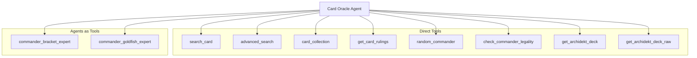
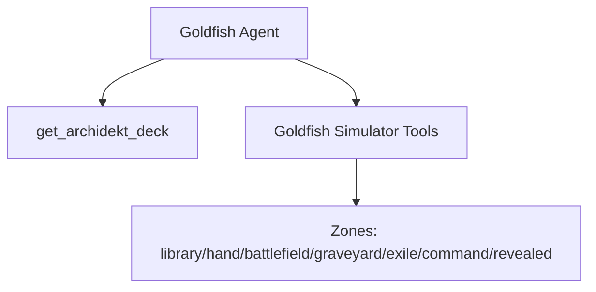
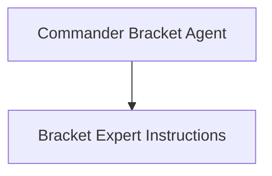

# Agent Architecture

This document explains how the main Card Oracle agent is composed, including tools and sub-agents.

## Card Oracle Agent (Main)

### Notes

- The Card Oracle agent is the single entry point for user queries.
- Deck-related tools only read from the in-memory Archidekt cache; agents never fetch URLs directly.
- Two sub-agents are exposed as tools to the main agent:
  - **Commander Bracket Expert** for bracket system analysis.
  - **Goldfish Expert** for simulation-based analytics using goldfish tools.

## Goldfish Agent Toolchain

### Goldfish Simulator Capabilities

- Loads the cached Archidekt deck into tool state (`loadDeck`).
- Resets/shuffles with deterministic seeds (`reset`, `shuffle`).
- Draws, peeks, and moves cards between zones (`draw`, `peek`, `moveById`, `findAndMoveByName`).
- Reports zone contents and counts for analytics.

## Commander Bracket Agent

### Notes

- The bracket agent is a focused LLM tool with domain-specific instructions.
- It does not directly access card APIs or deck caches unless the main agent provides the context.
