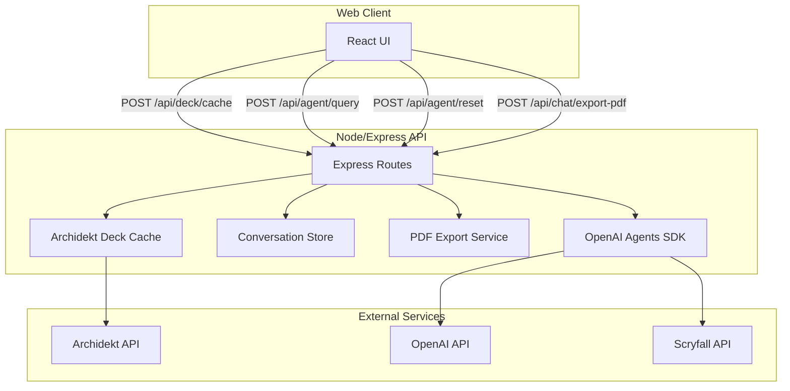

# Architecture Overview

This document describes the main runtime components and how they connect.

## System Components

## Key Runtime Responsibilities

- **Web Client**: Collects user input, triggers deck load, analysis/goldfish runs, and PDF export.
- **Express API**: Orchestrates requests, manages conversation IDs, and forwards agent runs.
- **Deck Cache**: Stores the most recently loaded Archidekt payload in memory so tools can query it.
- **Conversation Store**: Tracks `lastResponseId` per conversation for OpenAI conversation history.
- **Agents SDK**: Runs the Card Oracle agent and its tools/sub-agents.
- **PDF Export**: Renders chat transcript (and deck metadata if present) to a PDF.

## Deployment Notes

- The deck cache and conversation state are in-memory and reset on server restart.
- The client and server are expected to run locally during development.
