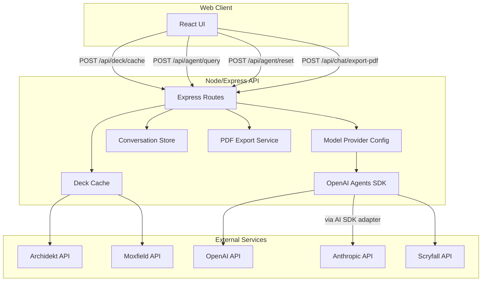

# Architecture Overview

This document describes the main runtime components and how they connect.

## System Components

```mermaid
graph TD
  subgraph Client[Web Client]
    UI[React UI]
  end

  subgraph Server[Node/Express API]
    API[Express Routes]
    DeckCache[Deck Cache]
    ConvStore[Conversation Store]
    PDF[PDF Export Service]
    ModelProvider[Model Provider Config]
    Agents[OpenAI Agents SDK]
  end

  subgraph External[External Services]
    OpenAI[OpenAI API]
    Anthropic[Anthropic API]
    Archidekt[Archidekt API]
    Moxfield[Moxfield API]
    Scryfall[Scryfall API]
  end

  UI -->|POST /api/deck/cache| API
  UI -->|POST /api/agent/query| API
  UI -->|POST /api/agent/reset| API
  UI -->|POST /api/chat/export-pdf| API

  API --> DeckCache
  API --> ConvStore
  API --> PDF
  API --> ModelProvider
  ModelProvider --> Agents

  Agents --> OpenAI
  Agents -->|via AI SDK adapter| Anthropic
  DeckCache --> Archidekt
  DeckCache --> Moxfield
  Agents --> Scryfall
```

## Key Runtime Responsibilities

- **Web Client**: Collects user input, triggers deck load, analysis/goldfish runs, and PDF export.
- **Express API**: Orchestrates requests, manages conversation IDs, and forwards agent runs.
- **Deck Cache**: Stores the most recently loaded deck payload in memory (Archidekt or Moxfield) so tools can query it.
- **Conversation Store**: Tracks provider-aware conversation state per conversation. For OpenAI, stores `lastResponseId` for the Responses API chain. For Anthropic, stores accumulated message history (`AgentInputItem[]`) since Anthropic has no server-side response chain.
- **Model Provider Config** (`server/src/config/model-provider.ts`): Resolves an `OracleModelSelection` into a model instance compatible with the Agents SDK. Returns a plain model string for OpenAI; wraps an `@ai-sdk/anthropic` model with the `aisdk()` adapter for Anthropic.
- **Agents SDK**: Runs the Card Oracle agent and its tools/sub-agents. Anthropic models are supported via `@openai/agents-extensions` AI SDK adapter.
- **PDF Export**: Renders chat transcript (and deck metadata if present) to a PDF.

## Provider Support

The app supports two LLM providers. Provider is selected per-request and defaults to `openai`.

| Provider | Header | Conversation history | Reasoning/verbosity settings |
|---|---|---|---|
| `openai` | `x-openai-key` | `previousResponseId` (Responses API) | Supported |
| `anthropic` | `x-anthropic-key` | Accumulated message history | Not supported (stripped server-side) |

## Deployment Notes

- The deck cache and conversation state are in-memory and reset on server restart.
- The client and server are expected to run locally during development.
