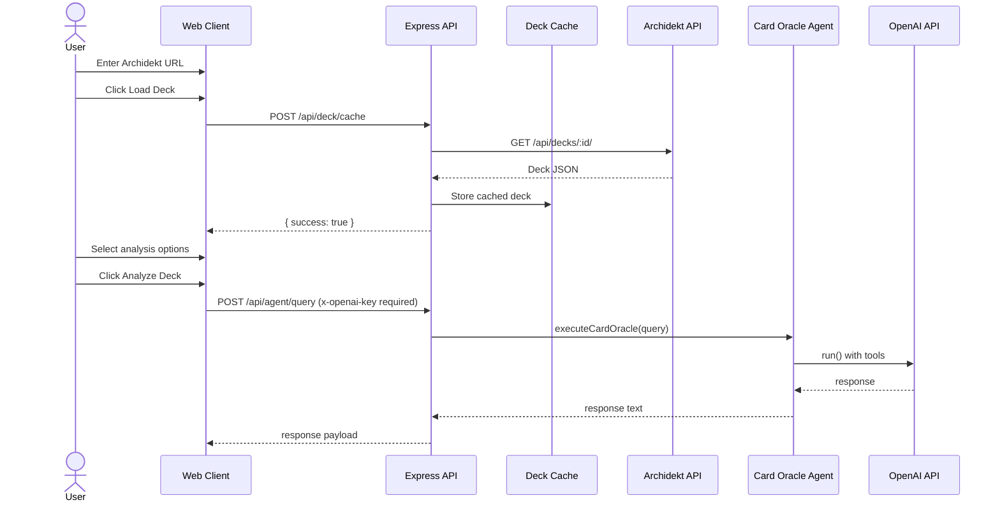
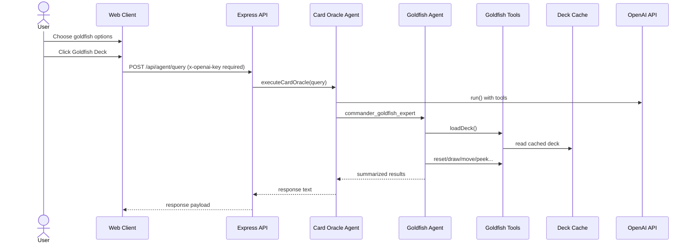
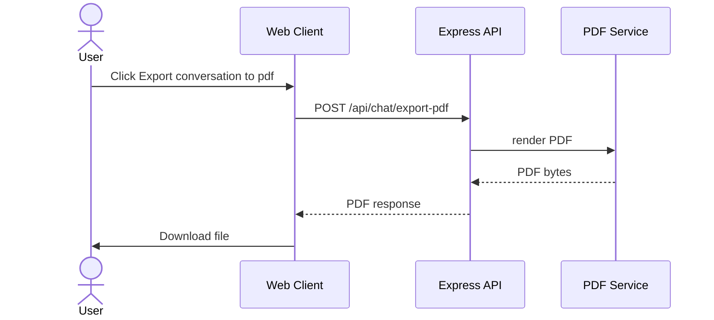

# Interaction Flows

This document captures key user flows with sequence diagrams.

## Load Deck and Analyze

```mermaid
sequenceDiagram
  actor User
  participant UI as Web Client
  participant API as Express API
  participant Deck as Deck Cache
  participant Archidekt as Archidekt API
  participant Agent as Card Oracle Agent
  participant OpenAI as OpenAI API

  User->>UI: Enter Archidekt URL
  User->>UI: Click Load Deck
  UI->>API: POST /api/deck/cache
  API->>Archidekt: GET /api/decks/:id/
  Archidekt-->>API: Deck JSON
  API->>Deck: Store cached deck
  API-->>UI: { success: true }

  User->>UI: Select analysis options
  User->>UI: Click Analyze Deck
  UI->>API: POST /api/agent/query (x-openai-key required)
  API->>Agent: executeCardOracle(query)
  Agent->>OpenAI: run() with tools
  OpenAI-->>Agent: response
  Agent-->>API: response text
  API-->>UI: response payload
```

## Goldfish Simulation

```mermaid
sequenceDiagram
  actor User
  participant UI as Web Client
  participant API as Express API
  participant Agent as Card Oracle Agent
  participant SubAgent as Goldfish Agent
  participant Tools as Goldfish Tools
  participant Deck as Deck Cache
  participant OpenAI as OpenAI API

  User->>UI: Choose goldfish options
  User->>UI: Click Goldfish Deck
  UI->>API: POST /api/agent/query (x-openai-key required)
  API->>Agent: executeCardOracle(query)
  Agent->>OpenAI: run() with tools
  Agent->>SubAgent: commander_goldfish_expert
  SubAgent->>Tools: loadDeck()
  Tools->>Deck: read cached deck
  SubAgent->>Tools: reset/draw/move/peek...
  SubAgent-->>Agent: summarized results
  Agent-->>API: response text
  API-->>UI: response payload
```

## Export Conversation to PDF

```mermaid
sequenceDiagram
  actor User
  participant UI as Web Client
  participant API as Express API
  participant PDF as PDF Service

  User->>UI: Click Export conversation to pdf
  UI->>API: POST /api/chat/export-pdf
  API->>PDF: render PDF
  PDF-->>API: PDF bytes
  API-->>UI: PDF response
  UI->>User: Download file
```
